# Examen Primera Evaluación

# Día 03/11/2020 Tiempo: 5 horas

- Nota: Cada pregunta se valorará como bien o como mal (valoraciones intermedias serán excepcionales).
- Nota2: En cada pregunta se especifica si se valora en el examen de diseño o en el de desarrollo o en ambos.
- Nota3: Para aprobar cada examen hay que obtener una puntuación mínima de 5 puntos en ese examen.
- Nota4: Organice su tiempo. Si no consigue resolver un apartado pase al siguiente. El examen consta de apartados de diseño y de desarrollo que por lo general se pueden resolver por separado. Si un apartado depende de otro que no sabe resolver, siempre puede dar una solución que aunque no sea correcta, le permita seguir avanzando.
- Nota5: Para que una solución sea correcta, no sólo hay que conseguir que haga lo que se pide, sino que además todo lo que funcionaba lo tiene que seguir haciendo. La solución debe estar implementada según las prácticas de código limpio explicadas en clase.
- Nota6: No se permiten modificaciones sustanciales del código que se le suministra en el enunciado, aunque sí puede hacer pequeñas variaciones.
- Nota7: Lea completamente el examen antes de empezar y comience por lo que le parezca más fácil.

Pasos previos antes de empezar

- Clone el repositorio del enunciado

```bash
git clone https://gitlab.com/surtich/enuncicado-examen-primera.2020.git enunciado-examen
```

- Vaya al directorio del proyecto

```bash
cd enunciado-examen
```

- Configure su usuario de git:

```bash
git config user.name "Sustituya por su nombre y apellidos"
git config user.email "Sustituya por su correo electrónico"
```

- Cree un _branch_ con su nombre y apellidos separados con guiones (no incluya mayúsculas, acentos o caracteres no alfabéticos, excepción hecha de los guiones). Ejemplo:

```bash
    git checkout -b <fulanito-perez-gomez>
```

- Compruebe que está en la rama correcta:

```bash
    git status
```

- Suba la rama al repositorio remoto:

```bash
    git push origin <nombre-de-la-rama-dado-anteriormente>
```

- Instale las dependencias y arranque la aplicación:

```bash
    yarn install
    yarn compile:sass
    live-server
```

Navegue a [http://localhost:8080](http://localhost:8080)

Debería ver esto:

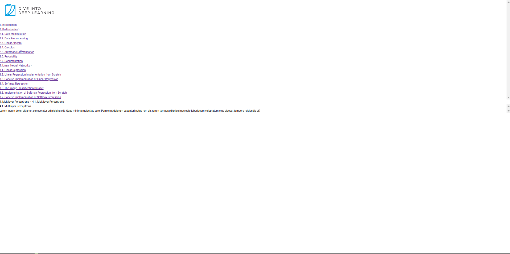

- Dígale al profesor que ya ha terminado para que compruebe que todo es correcto y desconecte la red.

## EXAMEN

#### 1.- Crear el "layout" de la aplicación.

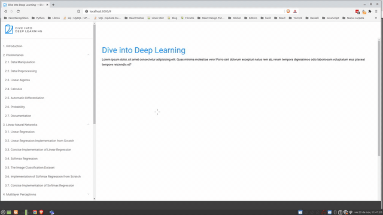


#### 1.1.- Organice la pantalla cómo se muestra en la imagen.

Nota: Respete colores y márgenes

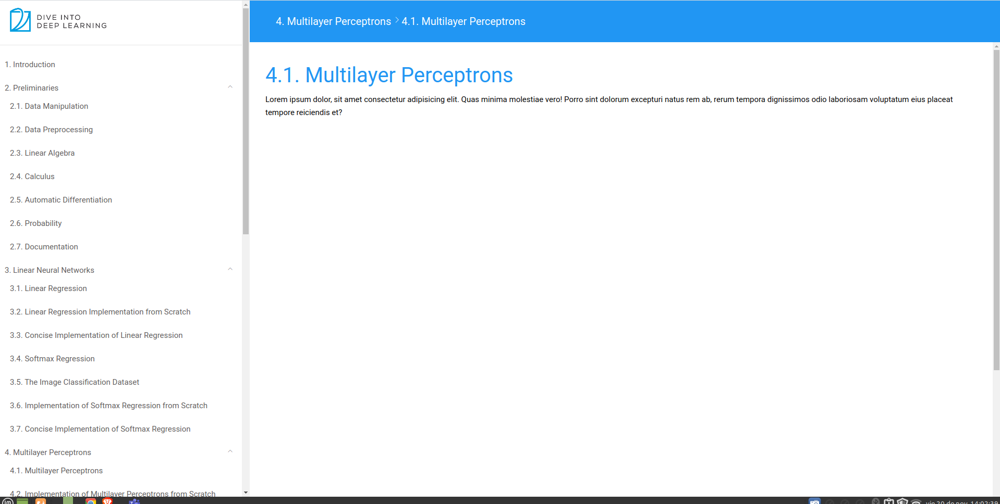

#### 1.1.1.- (2,5 puntos diseño) Por dividir la pantalla en las cuatro secciones respetando disposición, colores, fuentes, estilos y márgenes.

#### 1.1.1bis.- (0,5 puntos diseño) Por pintar correctamente la línea debajo del logo.

#### 1.1.1bis2.- (0.5 puntos diseño) El camino de migas o "breadcrumb" estará centrado verticalmente y desplazado ligeramente a la izquierda.

#### 1.1.2.- (0.5 puntos diseño) Cuando el contenido del menú y de "main" no quepa, habrá sendas barras de "scroll".

#### 1.1.3.- (0.5 puntos diseño) El contenido se adaptará al tamaño de la pantalla.

#### 1.1.4.- (0.5 puntos diseño) El camino de migas o "breadcrumb" estará fijado en la parte superior

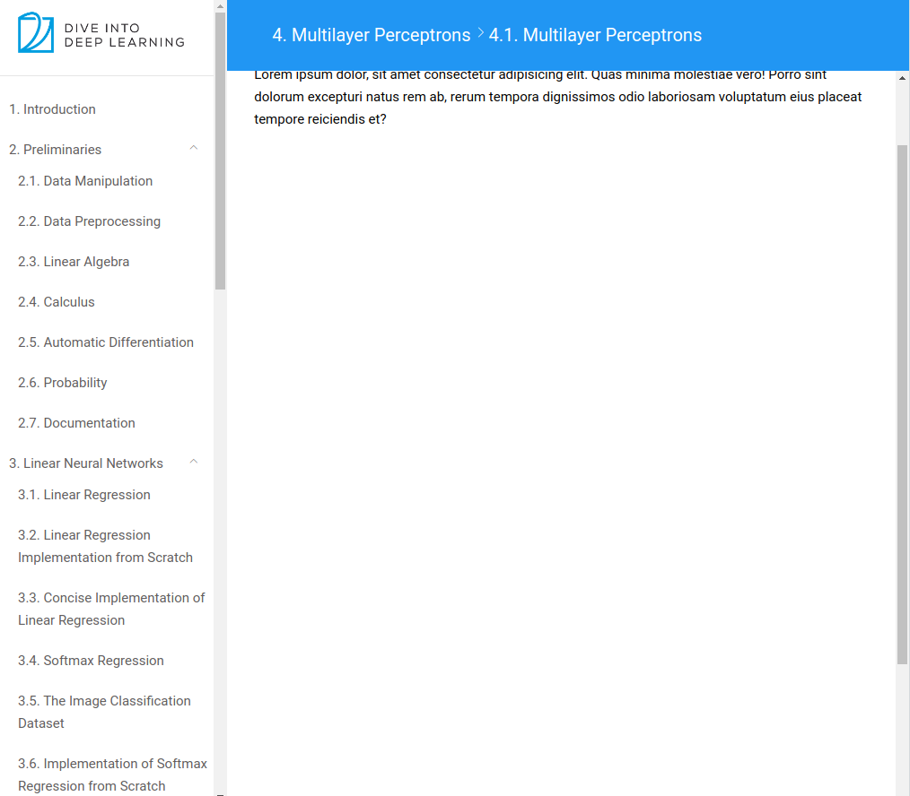

#### 1.1.5.- (1 punto diseño) Los botones de abrir/cerrar submenús estarán alineados a la derecha y centrados.

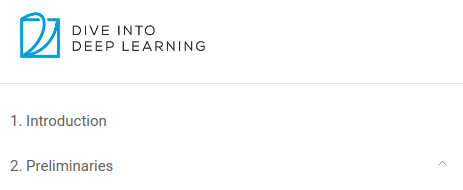

#### 1.1.6.- (0.5 puntos diseño) Los submenús estarán sangrados respecto a su padre.

Nota: Ver imagen anterior

#### 1.1.7.- (1 puntos diseño) Al situarse encima del botón de abrir/cerrar menú se resaltará cambiando el fondo con una transición animada.

#### 1.1.7bis.- (1 puntos diseño) El fondo será redondeado y el icono estará centrado.

#### 1.1.7bis2.- (0,5 puntos diseño) El cursor del ratón será "pointer".


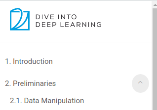

#### 1.1.8.- (1 puntos diseño) Al pulsar sobre un botón de abrir/cerrar menú se conmutará por el otro estado.

#### 1.2.- Programe la funcionalidad.

#### 1.2.1.- (1 punto desarrollo) Al pulsar sobre el logo, se ocultará el camino de migas.
#### 1.2.2.- (1 punto desarrollo) Al pulsar sobre un menú/submenú, se seleccionará. El resto de opciones volverán al estado normal.

Nota: No puede hacer esto con el "hack de CSS"

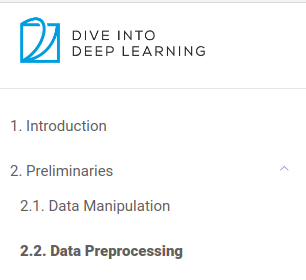

#### 1.2.3.- (0,5 puntos desarrollo) Al pulsar sobre el logo, se deseleccionarán las opciones menú.

#### 1.2.4.- (1 punto desarrollo) Los botones de abrir/cerrar submenú mostrarán u ocultarán el submenú correspondiente.

Nota: No puede hacer esto con el "hack de CSS"

#### 1.2.5.- (1 punto desarrollo) Al pulsar sobre un menú/submenú, el título se pondrá sobre el contenido principal.

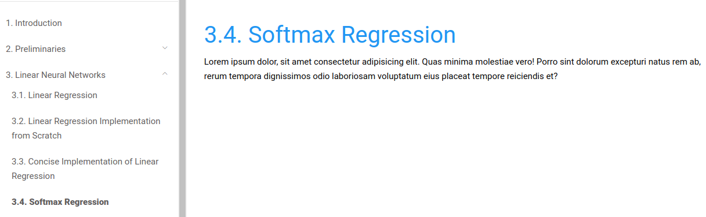

#### 1.2.6.- (2 puntos desarrollo) Al pulsar sobre un menú/submenú, el título se pondrá sobre el camino de migas. Si la opción pulsada es un submenú, también se mostrará el menú padre.

Nota: Si puntuó la opción anterior, en esta sólo se valorará la segunda parte (pulsar obre un submenú).

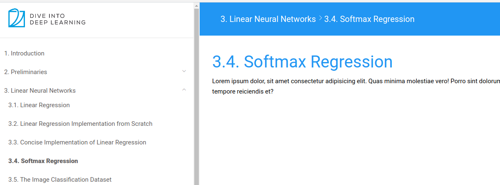

#### 1.3.- El menú se creará desde JavaScript.

Nota: En el fichero `js/menu.js` tiene los menús/submenús. No puede modificar su estructura ni su contenido. Observe que se trata de un array cuyos elementos son cadenas de texto y subarrays de cadenas de texto. Los primeros son menús y los otros submenús cuyo menú es la cadena de texto anterior. Por lo tanto, las cadenas de texto y los arrays de cadenas tienen que estar intercalados (no puede haber dos elementos de tipo array consecutivos).

Nota2: Para saber si una variable es de tipo `string` puede usar:

```javascript
    typeof x === "string"
```

Nota3: Para saber si una variable es de tipo `Array` puede usar:

```javascript
    Array.isArray(xs)
```

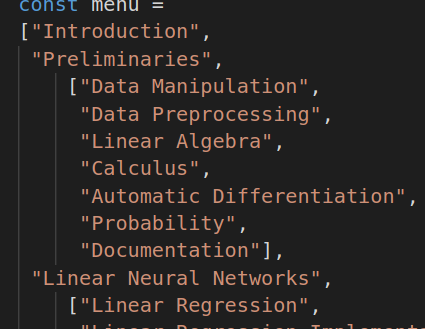

#### 1.3.1.- (1 punto desarrollo) Implemente la función `numberMenu` que recibe una variable del tipo menú antes descrito y permite numerar cada opción con índice y subíndice.

Nota: No se describe exactamente lo que devuelve para permitirle una mayor libertad de implementación. Lo importante es que el resultado contenga los códigos de numeración correctos y adecuados para crear el menú.

#### 1.3.2.- (2 puntos desarrollo) Cree el menú con las mismas especificaciones que el menú estático inicial.

Nota: Debe eliminar el menú estático de HTML.

#### 1.3.3.- (0,5 puntos desarrollo) Los menús con submenús tendrán un botón de abrir/cerrar submenú.

#### 1.3.4.- OPCIONAL, ADICIONAL y DIFÍCIL (1 punto desarrollo) Implemente la posibilidad de que el número de niveles de submenús sea arbitrario. Tenga en cuenta el camino de migas.

Nota: La nota que consiga en este apartado, se sumará al examen y también se le sumará a su nota media final de Desarrollo Cliente.


Ejemplo: El siguiente menú tiene cuatro niveles.

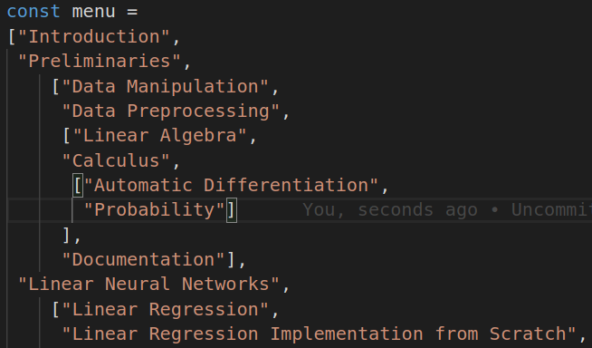


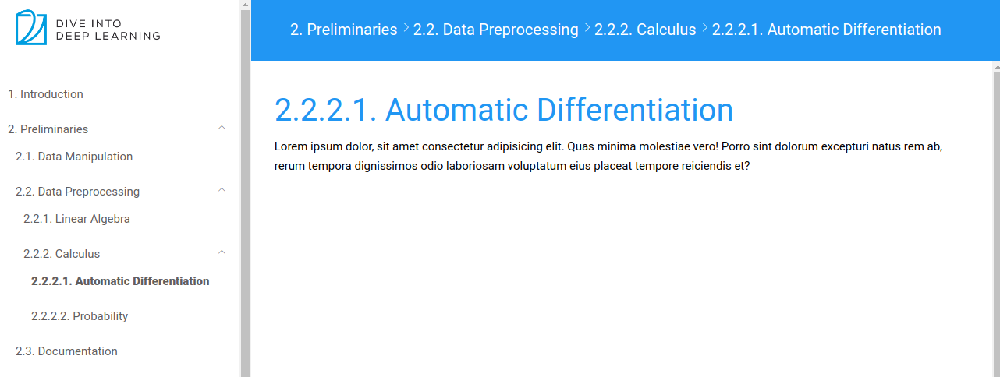

## Para entregar

- Ejecute el siguiente comando para comprobar que está en la rama correcta y ver los ficheros que ha cambiado:

```bash
    git status
```

- Prepare los cambios para que se añadan al repositorio local:

```bash
    git add .
    git commit -m "completed exam"
```

- Compruebe que no tiene más cambios que incluir:

```bash
    git status
```

- Dígale al profesor que va a entregar el examen.

- Conecte la red y ejecute el siguiente comando:

```bash
    git push origin <nombre-de-la-rama>
```

- Abandone el aula en silencio.